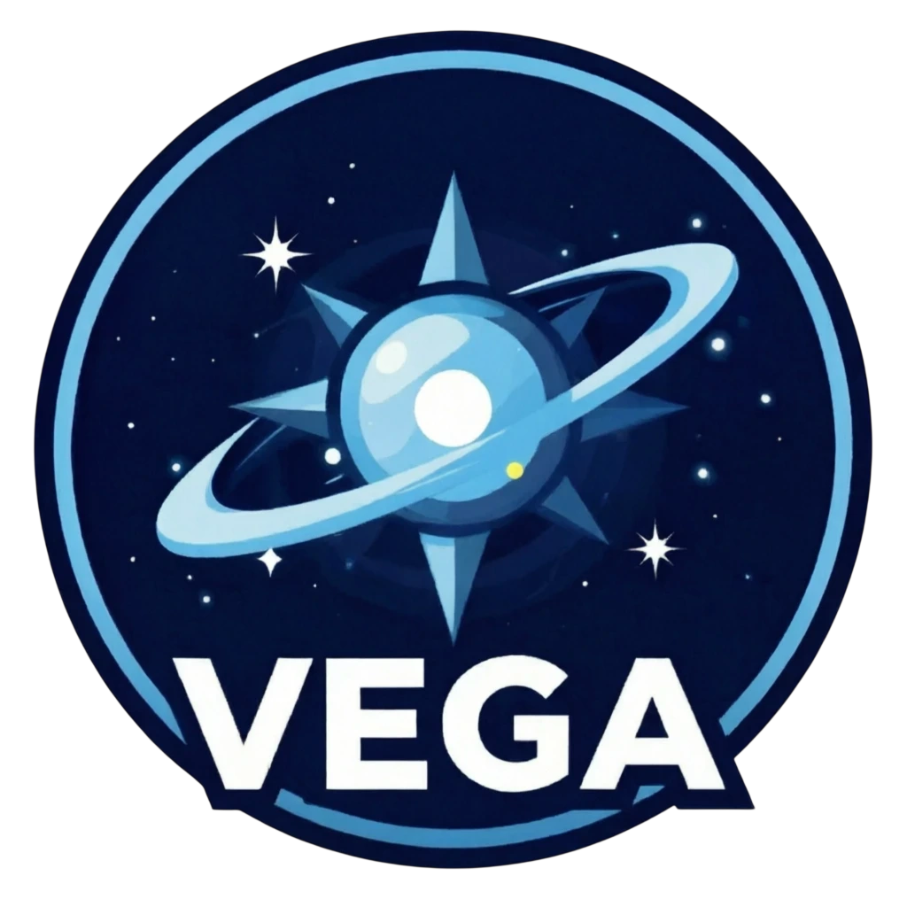

# Lumina Space — Vega Station



**Lumina Space** — активно развивающийся проект на базе Space Station 14. Мы объединили стабильность современных наработок с уникальным контентом и вниманием к деталям. Будь ты опытным ролевиком или новичком, здесь ты найдешь уютную атмосферу и новые возможности для реализации своих самых смелых идей на борту станции.

[](https://discord.gg/QU6s5xnyRe)


[](https://store.steampowered.com/app/1255460/Space_Station_14/)
[](https://spacestation14.com/about/download/)
</div>


## 📑 Документация

На официальном сайте [с документацией](https://docs.spacestation14.com/) имеется вся необходимая информация о контенте SS14, движке, дизайне игры и многом другом. Также представлено множество полезных материалов для начинающих разработчиков.

## 🤝 Контрибьют

Если Вы желаете помочь в улучшении репозитория, решением проблем или создания нового контента, мы рады принять Ваш вклад. Заходите в Discord, если хотите помочь. Не бойтесь просить о помощи!
Только убедитесь, что Ваши изменения и PRы соответствуют нашему [руководству по контрибьюту](CONTRIBUTING.md).

## 📦 Информация по сборке

1. Скачайте Dotnet SDK с [официального сайта Microsoft](https://dotnet.microsoft.com/en-us/download).
2. Скачайте последнюю версию Python с [официального сайта](https://www.python.org/downloads).
3. Авторизуйтесь на GitHub при помощи команды `gh auth` и склонируйте этот репозиторий:
```shell
gh repo clone Lumina-Space-Project/vega-station
```
4. Запустите команду `python RUN_THIS.py` для инициализации подмодулей и скачивания движка [Robust Toolbox](https://github.com/space-wizards/RobustToolbox).
5. Откройте консоль в директории проекта.
6. Соберите проект с помощью `dotnet build`.
7. Запустите клиент и сервер при помощи комманд:
```shell
dotnet run --project Content.Server
dotnet run --project Content.Client
```

*Более подробная инструкция по запуску проекта - [здесь](https://docs.spacestation14.com/en/general-development/setup.html)*

## ⚖️ Лицензирование

Настоящий Проект включает в себя программный код от Space Wizards Federation, распространяемый на условиях лицензии [MIT](LICENSES/MIT.md), а также оригинальные изменения и дополнения, внесенные Организацией.

1. Базовый код остается под действием лицензии [MIT](LICENSES/MIT.md). Во избежание правовых коллизий и смешения компонентов пользователям, заинтересованным исключительно в чистом исходном коде, рекомендуется обращаться к [репозиторию первоисточника](https://github.com/space-wizards/space-station-14).

2. Собственные разработки являются интеллектуальной собственностью и лицензируются на условиях [настоящей Лицензии](LICENSES/LicenseRef-Lumina-Space-1.0.md).

3. Большинство медиа-активов лицензированы по CC-BY-SA 3.0, если не указано иное. Информация о лицензии и авторских правах для активов находится в файле метаданных. [Пример](Resources/Textures/Objects/Tools/crowbar.rsi/meta.json).

4. Контрибьюция: Передавая изменения в проект, вы предоставляете Организации безвозмездную и безотзывную лицензию на их использование в рамках проекта (подробнее — в тексте [настоящей Лицензии](LICENSES/LicenseRef-Lumina-Space-1.0.md)).

## ❤️ Благодарности
* **[Space Wizards Federation](https://spacestation14.com)** — за создание и поддержку Space Station 14.
* Всем контрибьюторам, чьи идеи и код помогают Lumina Space сиять ярче.
